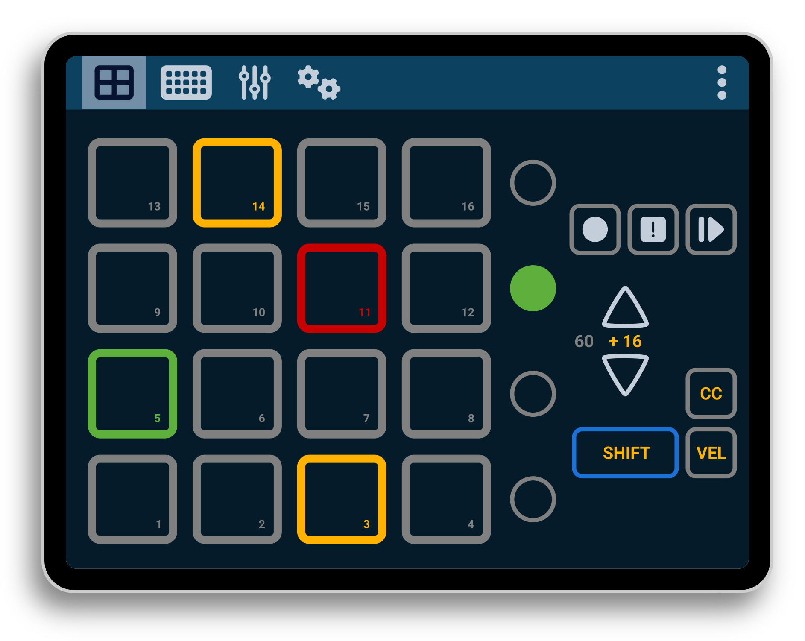

## Overview

This is a Web MIDI controller. It is designed to work as a companion tool for [Zynthian](https://zynthian.org). See more information in the [user manual](docs/MANUAL.md).

## Requirements

This app relies uses local MIDI devices. To connect to a remote device, you can use RTP-MIDI, or Network MIDI 2.0. For Ubuntu/Debian Linux, install one of these services:

* https://github.com/oscaracena/jacknetumpd
* https://github.com/davidmoreno/rtpmidid/releases

## Development References

* https://developer.mozilla.org/en-US/docs/Web/Progressive_web_apps/Guides/Making_PWAs_installable
* https://m3.material.io/styles/color/roles
* https://developer.mozilla.org/en-US/docs/Web/API/Pointer_events
* https://developer.mozilla.org/en-US/docs/Web/API/IndexedDB_API/Using_IndexedDB
* https://kabbouchi.github.io/tippyjs-v4-docs/html-content/
