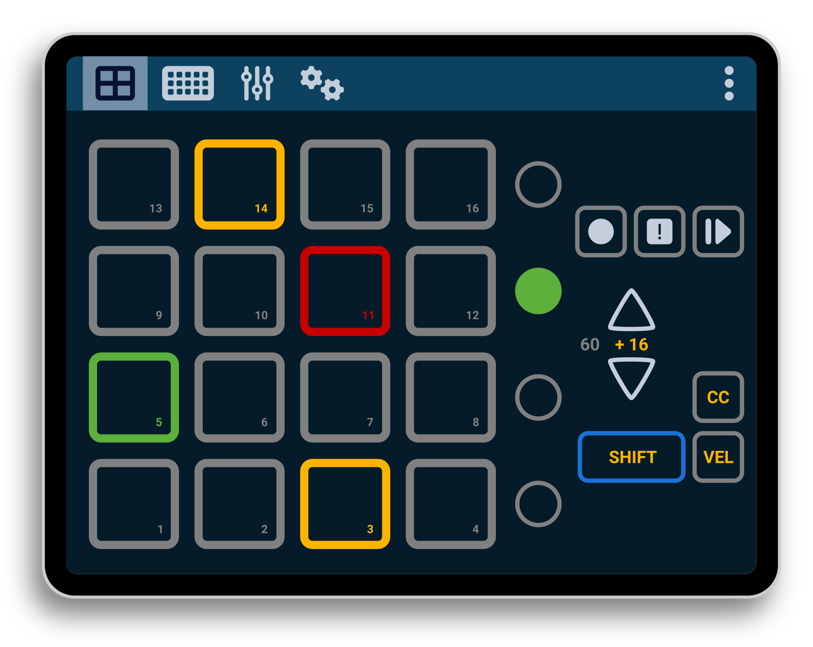

## Overview & User Manual

The controller is divided into several parts, called Areas. These are 1) **PADs Area**, 2) **GRID Area** and 3) **CONTROLs Area**. There is also a separated panel dedicated to the **application settings**. You can access these areas using the top bar buttons. The active one will be highlighted. Pressing the *three-dots* button will hide/show the bar.

### PADs Area

This area is made up 16 big buttons called **PADs**. They are arranged in 4 rows of 4 columns. Each PAD sends either a pair of Note-On (on press) and Note-Off (on release) messages, or a single Control Change (CC, on release), depending on the current configuration. By default, they will send Note-On/Off messages, but you can change it using the `CC` button.

PADs are numbered from left to right, from bottom to top, starting at index 1 (bottom left PAD) up to index 16 (top right PAD). The range of notes sent is also configurable. By default, it starts on note 60 (C4 or 'middle C') up to 75 (also for CC numbers). You can see the current "root note" as a number, in the right side.

The velocity (or the CC value) is fixed, since a touchscreen is usually not pressure sensitive, sending the value of the PAD. This value is defined in settings, but can be modified for each PAD. To do so, press the button `VEL` once, to activate the *Velocity mode*, where you can see all current velocities. To change a value, press and drag horizontally that PAD. Once finished, press `VEL` again. The new PAD velocity will be stored in your current profile. If a PAD does not have a custom velocity, it will use the default value (as given in settings). If you want to remove all custom velocities, while *Velocity mode* is active, press `SHIFT` and then `VEL`.

Regarding the channels for this Area, there are two defined: `Channel A` (which by default is 0) is the channel used for events sent by the PADs. `Channel B` (default 1) is used by the auxiliary buttons (like `SHIFT` or transpose controls).

There is also three transpose buttons: **record**, **stop** and **play/pause**. They send CC messages  on release event, according to their mapping. To adjust the range of notes sent by the PADs, you can use the **up/down buttons**. The current offset is shown between both buttons, and express the amount of notes that will be added to the "root note", which is the used by the first PAD. For instance, a +16 will indicate that the PAD 1 will send the "root note" + 16.

The `SHIFT` button is latched, which means that when pressed, it will keep that state until next button is pressed. Thus, to send the combination `SHIFT + play`, you need to press (and release) `SHIFT`, which will be kept as pressed, and then press (and release) the play button. You can, also, do this combination at once, without releasing the `SHIFT` button. You can also lock the `SHIFT` by doing a double-tap. And, to clear an active `SHIFT` button, press it again. On press, it will send a CC message (using the assigned CC number, and the default velocity as CC value). On release, it will send another CC message, with the value set to zero.

Near each row of PADs there is another button that will send CC messages (acording to its own configuration). These are the **row LAUNCH** buttons, and can be used to control or select all PADs of a row, or for custom functions.

#### Buttons state

Some buttons on this area (namely, the PADs, row LAUNCH and transpose buttons) can be controlled with incoming messages on `Channel A`. First 16 notes (0-15) are for the PADs, notes from 16 to 19 are the row LAUNCH buttons, and then goes rec (20), stop (21) and play/pause (22). A Note-On message is used to change its color, taking the velocity as the index for a color mapping (which you can change in the settings area). A CC message will change some effects of the button, depending on the given value. And a Note-Of message will reset the color to its default state, and remove any applied effect.

The value used for the effect has the following format: the left four bits (only 3 are used, from 0 to 7) indicates the effect, and the remaining bits (16 values) are the amount of the effect to be applied. The available effects are given in the following table:

| Effect Code | Effect Name | Description                               | Parameter         |
|-------------|-------------|-------------------------------------------|-------------------|
| 0           | Solid       | The button remains solid with no effects  | None              |
| 1           | Blinking    | The button blinks on and off              | Speed of blinking |
| 2           | Glowing     | The button glows in and out               | Speed of glowing  |

And the range of speed values, from 2000 ms to 50 ms, is as follows:

| Index | Speed (ms) | Index | Speed (ms) | Index | Speed (ms) | Index | Speed (ms) |
|-------|------------|-------|------------|-------|------------|-------|------------|
| 0     | 2000       | 4     | 1500       | 8     | 1000       | C     | 500        |
| 1     | 1875       | 5     | 1375       | 9     | 875        | D     | 375        |
| 2     | 1750       | 6     | 1250       | A     | 750        | E     | 250        |
| 3     | 1625       | 7     | 1125       | B     | 625        | F     | 125        |

For example, sending a CC message with 0x1A as value, instructs the button to blink at 750 ms (the cycle will be 750 ms, so half of the time will be on, and the other half will be off).

### GRID Area

### CONTROLs Area

### SETTINGS Area

This area is dedicated to setting up the whole application. It has several sections: 1) General, 2) MIDI, 3) PADs, 4) GRID, 5) CONTROLs and 6) Help.

In the `General` section, you can control the global aspects of the application. The first thing to note is the **profile** used. Each profile will hold all the customized settings. You can rename, create, clone, export/import and delete your own profiles. Besides, here you can also change the **theme**, and the **color mapping**, used for the status feedback received from other MIDI devices. In addition, you can enable/disable the **haptic feedback** (vibration).

The `MIDI` section is used to setup global MIDI settings. In particular, the `input` and `output` ports to/from which connect.

The settings for the `PADs Area` are adjusted in the `PADs` section. Here, you can set the default operation mode for the PADs: send Note-On/Off events or a single CC event. The **root note** property is used to indicate the note or CC number that will be send by the PAD 1; valid values are in the range [0, 112]. The **velocity** is the default velocity (or value) sent by the PADs. Regarding **MIDI channels**, here you can set both `Channel A` and `Channel B`. Also, in this section you can modify the **CC event numbers** that will be sent by the auxiliary buttons (transpose controls, `SHIFT` and LAUNCH buttons).

The `GRID` section...
> Pending to be written

The `CONTROLs` section...
> Pending to be written

The `Help` section contains useful links, such as this manual, the Zynthian forums, and the GitHub repository. There is also a link to an Android application that can be used as a bridge between MIDI 1.0 and Network MIDI (using UMP). Additionally, users can view and download the app logs, and there is a button to restart the application.

